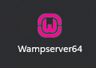
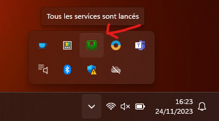
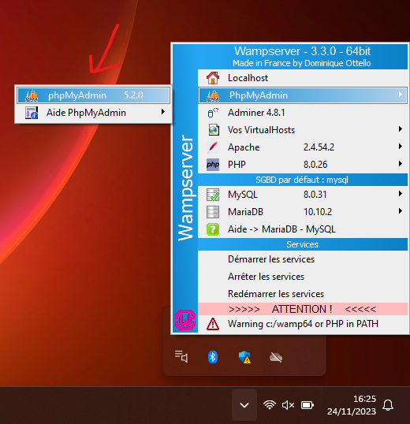
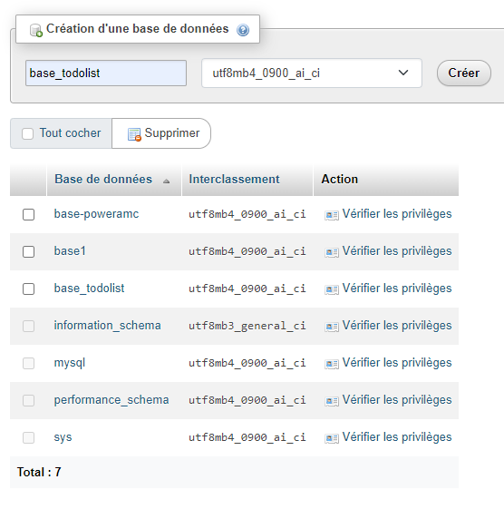
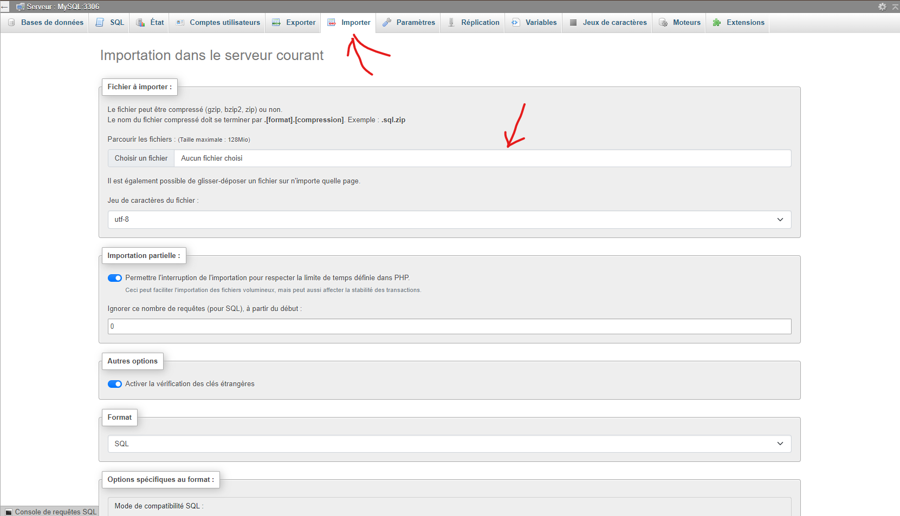

# TODOLIST

## Instalation du project

- Installer un éditeur de code **[Visual Studio Code](https://code.visualstudio.com/)**.

- Installer pour clone le project **[Git Bash](https://git-scm.com/downloads)**.

- Installer **[WampServer](https://sourceforge.net/projects/wampserver/)**.

## Lancement du projet

### Si tes dans ton fichier utilisateur

```bash
cd ..\..\wamp64\www\
```

### Cloner le project

```bash
git clone https://github.com/EdenSchoolFrance/TodoList_2023.git
```

### Accéder a ma branche de mon project

```bash
git checkout -b Ethan
```

### Lancée WampServer et ne rien touché!



### Aller sur les icon cachées et clic droit sur le logo Wamp



### Cliquer sur phpMyAdmin



### Crée une nouvel base que vous nommer "base_todolist"



### Et dans cette base, importer le ficher SQL qui se trouve dans le fichier parent TodoList_2023



### Lancée Visual Studio Code est installer l'extensions live-sass

### Puis pour lancée le project diriger vous de nouveau sur les icon cachées Wamp et clic droit sur Location, et dirige toi dans le fichier Todolist public et pages

## La ou j'ai eu le plus de dificulter

### Finis

- La ou quand tu crée un nouveau compte et de récuperer le derniere id crée
- Le JavaScript pour faire le addEventListener sur chaque todo
- Le password hash et verify avec les expliquation de Joan
- Joan ma expliquer comment verifier si le nom d'utilisateur est deja pris
- Le SCSS ne marche pas meme avec l'extenssion Live Sass Compiler (j'essaierais plus tard avec composer)

### Pas finis

- Pour ajouter l'innoDB dans PowerAMC
<!-- - Ajax -->
